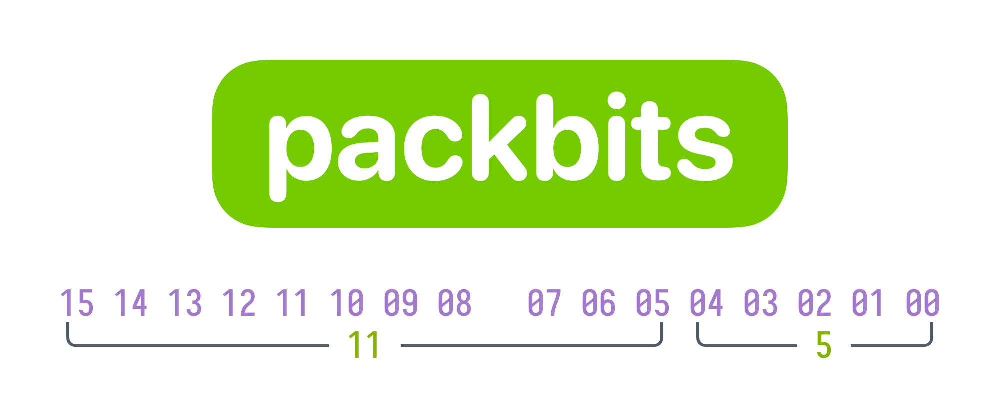
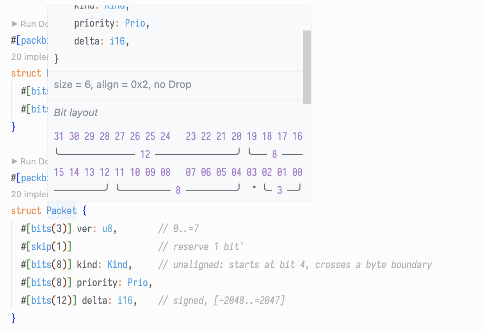

packbits — tiny, zero-boilerplate bit packing for your own structs

Pack and unpack your own structs directly to fixed-size byte arrays (and optional integer containers) with a single attribute. You keep your type's API; the macro only adds conversions.

- One attribute: `#[pack(bytes = N)]` or `#[pack(u8|u16|u32|u64|u128)]` (defaults to `#[pack(u8)]`)
- Per-field controls: `#[bits(W)]`, `#[skip(N)]`
- Clean, no_std-friendly, straight-line byte ops (no runtime loops)
- Auto-generated bit layout diagram right in your docs

## Why packbits?

Most bitfield crates generate an alternative API (getters/setters, opaque wrappers). packbits is different: it doesn't touch your public surface. You define a normal Rust struct (named or tuple), and get `From`/`TryFrom` impls for `[u8; N]` and, optionally, an integer container. That's it—boring conversions you can compose anywhere.

## Usage

```rust
enum Prio { Low, Med, Hi }

impl From<Prio> for u8 {
	fn from(p: Prio) -> u8 {
		match p {
			Prio::Low=>0,
			Prio::Med=>1,
			Prio::Hi=>2
		}
	}
}

impl TryFrom<u8> for Prio {
	type Error = &'static str;
	fn try_from(v: u8) -> Result<Self, Self::Error> {
		Ok(match v & 0b11 {
			0=>Prio::Low,
			1=>Prio::Med,
			2=>Prio::Hi,
			_=>unreachable!()
		})
	}
}

#[packbits::pack(u8)]
struct Kind {              // totals 8 bits
	#[bits(3)] class: u8,    // 0..=7
	#[bits(5)] code: u8,     // 0..=31
}

#[packbits::pack(u32)]
struct Packet {
	#[bits(3)] ver: u8,        // 0..=7
	#[skip(1)]                 // reserve 1 bit`
	#[bits(8)] kind: Kind,     // unaligned: starts at bit 4, crosses a byte boundary
	#[bits(8)] priority: Prio,
	#[bits(12)] delta: i16,    // signed, [-2048..=2047]
}

let p = Packet {
	ver: 1,
	kind: Kind { class: 0b101, code: 0x12 },
	priority: Prio::Med,
	delta: -7,
};

// Integer container roundtrip (little-endian on the wire)
let word: u32 = p.try_into().unwrap();
let back_from_word: Packet = word.try_into().unwrap();

// Or via a fixed-size byte array
let bytes: [u8; 4] = p.try_into().unwrap();
let back_from_bytes: Packet = bytes.try_into().unwrap();
```

## Features at a glance

- Attribute on a plain, named-field struct:
  - `#[pack(bytes = N)]` packs into `[u8; N]`
  - `#[pack(u8|u16|u32|u64|u128)]` additionally enables integer container conversions
  - Optional bit order per byte: `msb` or `lsb` (default `lsb`)
  - Also works on tuple structs
- Per-field directives:
  - `#[bits(W)]` width override (1..=128). If omitted for primitive integers/bool, the full width is inferred (bool=1, u8/i8=8, …, u128/i128=128)
  - `#[skip(N)]` reserve N bits immediately before the field
- Conversions:
  - If all fields are primitives (bool or integers): `From<T> for [u8; N]` and `From<[u8; N]> for T`
  - If any field is non-primitive (a custom type): both directions become fallible: `TryFrom<T> for [u8; N]` and `TryFrom<[u8; N]> for T`
  - With an integer container: same rule—`From<T> for uX`/`From<uX> for T` when all fields are primitives; otherwise `TryFrom` in either direction
- Documentation candy: the macro appends an ASCII diagram of the packed layout (grouped rows, widths labeled) into your struct's doc comments.

## Bit order and endianness

- Bit order controls numbering within each byte:
  - `lsb` (default): bit 0 is the least-significant bit (1 << 0)
  - `msb`: bit 0 is the most-significant bit (1 << 7)
- Multi-byte, byte-aligned loads/stores for primitive fields use little-endian (`to_le_bytes`/`from_le_bytes`). Integer container conversions also use little-endian.

```rust
#[packbits::pack]
struct Lsb {
	#[bits(1)] b0: u8, // occupies 0x01 when set
	#[bits(1)] b1: u8, // 0x02
}

#[packbits::pack(msb)]
struct Msb {
	#[bits(1)] b0: u8, // occupies 0x80 when set
	#[bits(1)] b1: u8, // 0x40
}

assert_eq!(<[u8;1]>::from(Lsb { b0:1, b1:0 })[0], 0x01);
assert_eq!(<[u8;1]>::from(Msb { b0:1, b1:0 })[0], 0x80);
```

## Signed fields and masking

Signed integers narrower than their native width are sign-extended on read and masked on write (shown in Example 1 via `delta: i16` with `#[bits(12)]`).

## Layout diagram

The macro appends a Markdown code block showing bit indices and labeled brackets. For example, the `Packet` above gets:

```rs
  31 30 29 28 27 26 25 24   23 22 21 20 19 18 17 16
  ╰─────────────── 12 ────────────────╯ ╰─── 8 ────
  15 14 13 12 11 10 09 08   07 06 05 04 03 02 01 00
  ──────────╯ ╰────────── 8 ──────────╯  ° ╰─ 3 ──╯
```



That's baked into the generated docs to help compare at a glance compare implementation with datasheets and get a visualize what's going on with bits.
